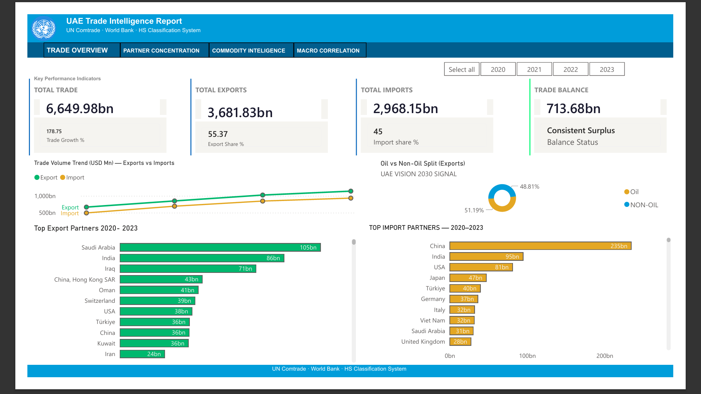
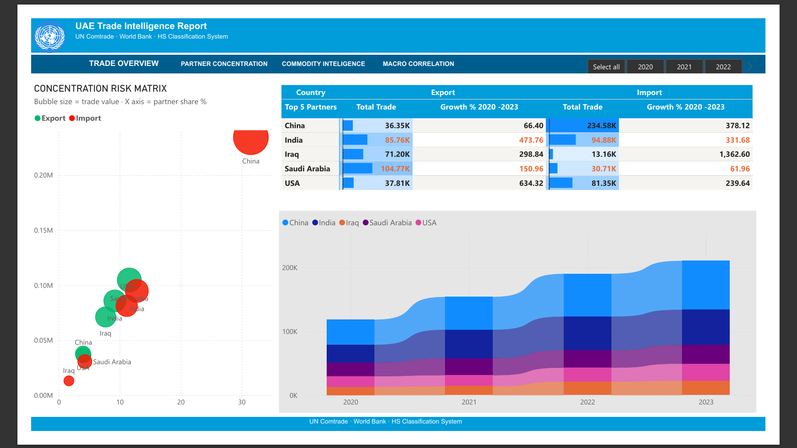
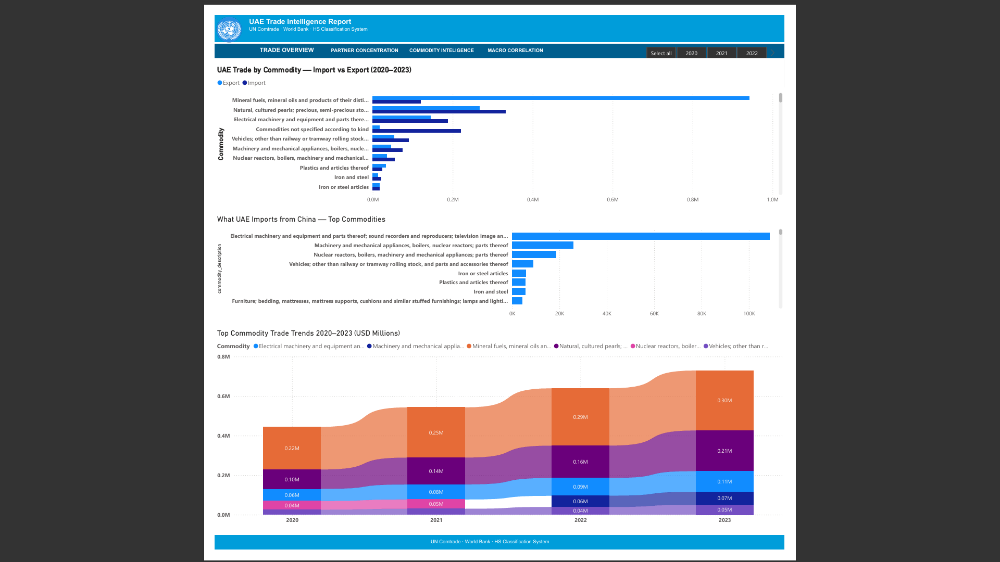
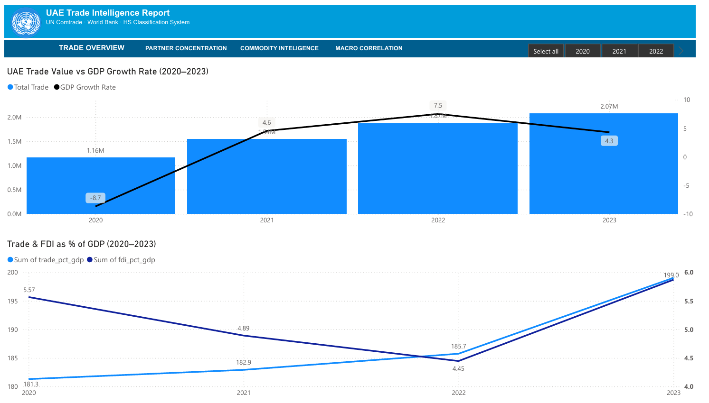

# UAE Trade Intelligence — End-to-End Analytics Case Study

> **Note:** This project uses UN Comtrade data for 2020–2023 as a portfolio case study demonstrating end-to-end analytics methodology.

## Project Overview

A full-stack business analytics project analysing UAE international trade patterns, commodity diversification, partner concentration, and macroeconomic correlations using real-world data from the UN Comtrade API and World Bank.

## Pipeline
UN Comtrade API → Pandas Cleaning → PostgreSQL → Power BI Dashboard → NumPy/Pandas Statistics → PowerPoint Report

## Key Findings

| Metric | Value |
|--------|-------|
| Total Trade Growth 2020–2023 | 78.75% |
| Non-Oil Trade Share | 61% |
| China Trade Share (Top Partner) | 12.72% |
| Top 5 Partners Combined | 37.10% |
| Trade vs GDP Correlation | 0.987 (directional, n=4) |
| Average Annual Growth Rate | 21.70% |

## Dashboard Preview

### Trade Overview

### Partner Concentration

### Commodity Intelligence

### Macro Correlation

## Tech Stack

| Tool | Purpose |
|------|---------|
| Python + Pandas | Data collection, cleaning, pipeline |
| PostgreSQL | Data storage, 8 analytical views |
| Power BI | Interactive 4-page dashboard |
| NumPy + Pandas | Statistical analysis |
| UN Comtrade API | Raw trade data |
| World Bank API | Macro indicators |

## Project Structure

├── data/
│   └── uae_trade_clean.csv        ## Cleaned dataset (89,396 rows)
├── notebooks/
│   └── UAE_Trade_Statistical_Analysis.ipynb
├── sql/
│   └── views.sql                  ## 8 PostgreSQL analytical views
├── assets/
│   └── *.png                      ## Dashboard screenshots
├── reports/
│   └── UAE_Trade_Intelligence_Report.pptx
└── README.md

## Analytical Limitations

- Correlation statistics based on 4-year window — directional trends only, not statistically significant
- 2022 energy price surge is a confounding variable in trade-GDP correlation
- HS 999 unclassified records excluded from commodity analysis
- Dataset covers 2020–2023 — for current trade intelligence, update via Comtrade API

## Data Sources

- [UN Comtrade](https://comtradeplus.un.org/) — Trade flows by commodity and partner
- [World Bank Open Data](https://data.worldbank.org/) — GDP, inflation, FDI indicators